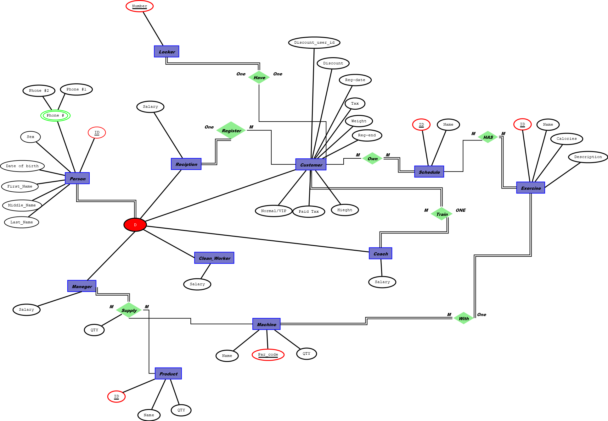
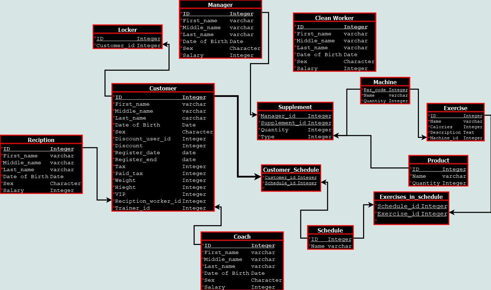
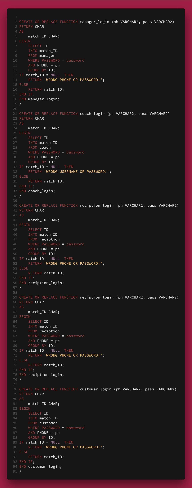
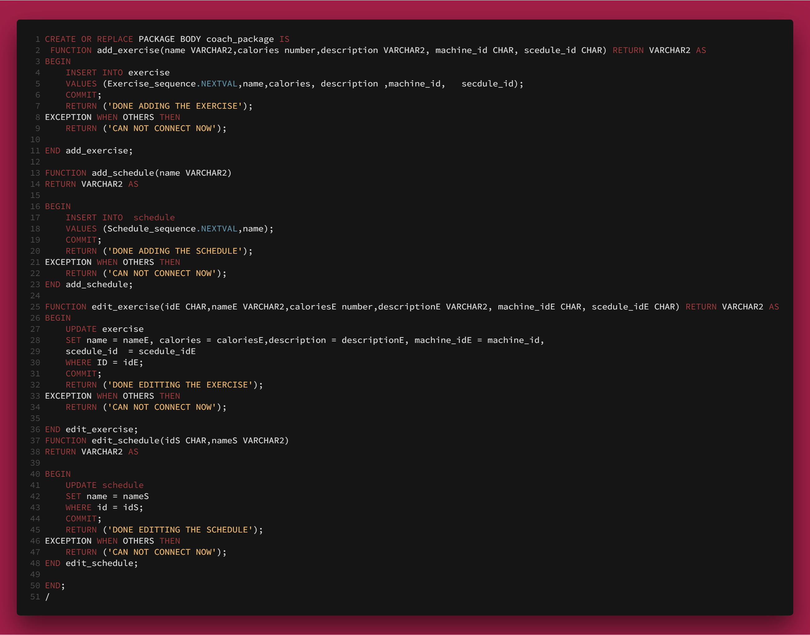
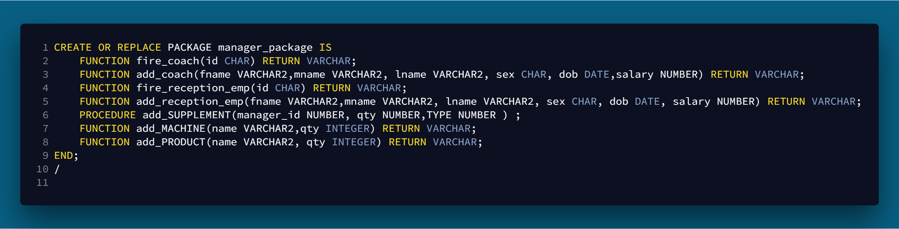
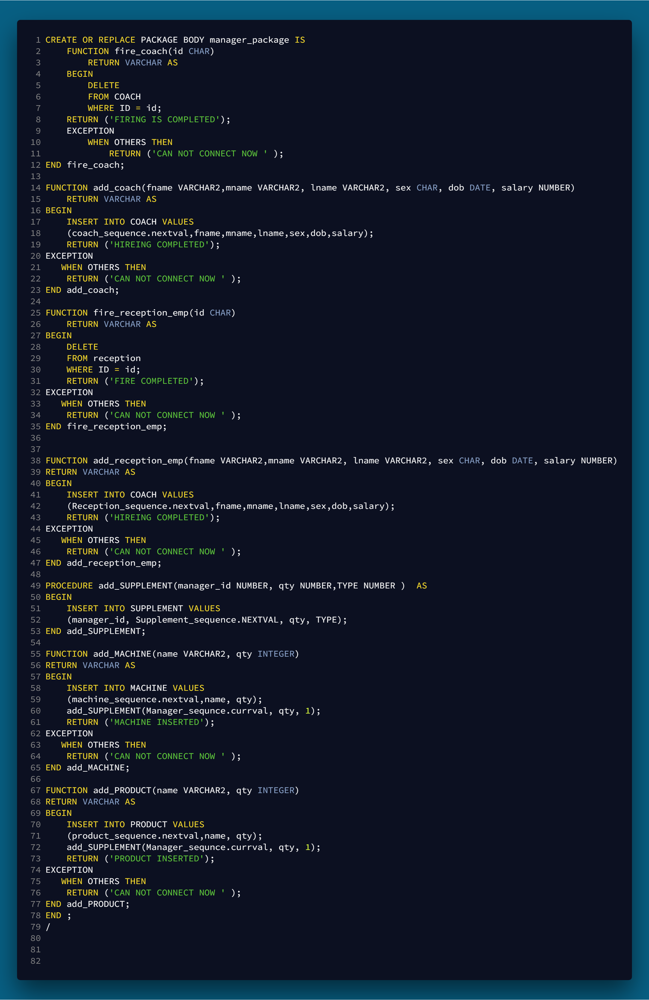
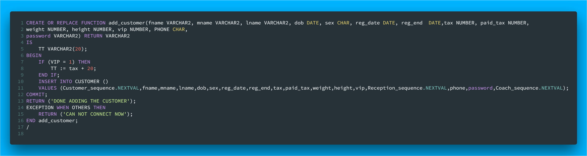

# Database Application programming Project

### This is a Gym implementation using Laravel 5.5 and Bootstrap for a class in university calls database application programming.
### semester : October 2017 to February 2018
### For  doctor Eman El-Naji.
# Database

The database is organized as the following:
- Employees (Reception, Coach, Manager, Clean Worker).
- We store the First name, middle name, last name, sex, phone(s), and date of birth for each Pearson (Employee or a customer).
- The Gym system will keep track of each employee salary.
- Each Reception employee register zero or more customers.
- If the multiple customers register together they will get a discount.
- Each customer has register date, Tax, paid Tax, weight, End register date, Height, Vip or normal, Discount register or without discount, and the customer will have a locker linked with him/her.
- Coaches will train any customer, but the customer can have a personal trainer.
- Keeping track of the user process by having schedule which have Name and many exercises.
- Exercises will have Name, Calories, Description and each exercise will be associative with one machine.
- The data about machines stored as the following, quantity, Par code, name. And machines should be supplied be any manager.
- The Gym should have a product section with quantity, name, And the manager should supply the products.
- Supplements process will be tracked by the manager id and the quantity of the product & the machine he/she bought.
### ER-Diagram 

### Schema

### Database code
```SQL
SET SQL_MODE = "NO_AUTO_VALUE_ON_ZERO";
SET AUTOCOMMIT = 0;
START TRANSACTION;
SET time_zone = "+00:00";


/*!40101 SET @OLD_CHARACTER_SET_CLIENT=@@CHARACTER_SET_CLIENT */;
/*!40101 SET @OLD_CHARACTER_SET_RESULTS=@@CHARACTER_SET_RESULTS */;
/*!40101 SET @OLD_COLLATION_CONNECTION=@@COLLATION_CONNECTION */;
/*!40101 SET NAMES utf8mb4 */;

--
-- Database: `dba_project`
--

-- --------------------------------------------------------

--
-- Table structure for table `clean_workers`
--

DROP TABLE IF EXISTS `clean_workers`;
CREATE TABLE IF NOT EXISTS `clean_workers` (
  `ID` int(11) NOT NULL AUTO_INCREMENT,
  `FIRST_NAME` varchar(10) NOT NULL,
  `MIDDLE_NAME` varchar(10) NOT NULL,
  `LAST_NAME` varchar(10) NOT NULL,
  `DOB` date DEFAULT NULL,
  `SEX` char(1) NOT NULL,
  `SALARY` int(11) NOT NULL,
  PRIMARY KEY (`ID`)
) ENGINE=MyISAM DEFAULT CHARSET=latin1;

-- --------------------------------------------------------

--
-- Table structure for table `coaches`
--

DROP TABLE IF EXISTS `coaches`;
CREATE TABLE IF NOT EXISTS `coaches` (
  `ID` int(11) NOT NULL AUTO_INCREMENT,
  `FIRST_NAME` varchar(10) NOT NULL,
  `MIDDLE_NAME` varchar(10) NOT NULL,
  `LAST_NAME` varchar(10) NOT NULL,
  `DOB` date DEFAULT NULL,
  `SEX` char(1) NOT NULL,
  `SALARY` int(11) DEFAULT NULL,
  `Phone` varchar(10) NOT NULL,
  `Password` varchar(12) NOT NULL,
  PRIMARY KEY (`ID`)
) ENGINE=MyISAM AUTO_INCREMENT=15 DEFAULT CHARSET=latin1;

-- --------------------------------------------------------

--
-- Table structure for table `customers`
--

DROP TABLE IF EXISTS `customers`;
CREATE TABLE IF NOT EXISTS `customers` (
  `ID` int(11) NOT NULL AUTO_INCREMENT,
  `FIRST_NAME` varchar(10) NOT NULL,
  `MIDDLE_NAME` varchar(10) NOT NULL,
  `LAST_NAME` varchar(10) NOT NULL,
  `DOB` date DEFAULT NULL,
  `SEX` char(1) NOT NULL,
  `DISCOUNT_USER_ID` int(11) DEFAULT NULL,
  `DISCOUNT` int(11) DEFAULT NULL,
  `REGISTER_DATE` date NOT NULL,
  `REGISTER_END` date NOT NULL,
  `TAX` int(11) NOT NULL,
  `PAID_TAX` int(11) NOT NULL,
  `WEIGHT` int(11) NOT NULL,
  `HIEGHT` int(11) NOT NULL,
  `VIP` int(11) NOT NULL,
  `RECEPTION_WORKER_ID` int(11) NOT NULL,
  `Phone` varchar(10) NOT NULL,
  `Password` varchar(12) NOT NULL,
  `TRAINER_ID` int(11) NOT NULL,
  PRIMARY KEY (`ID`),
  KEY `RECEPTION_WORKER_ID` (`RECEPTION_WORKER_ID`),
  KEY `TRAINER_ID` (`TRAINER_ID`)
) ENGINE=MyISAM AUTO_INCREMENT=7 DEFAULT CHARSET=latin1;

-- --------------------------------------------------------

--
-- Table structure for table `customer_schedules`
--

DROP TABLE IF EXISTS `customer_schedules`;
CREATE TABLE IF NOT EXISTS `customer_schedules` (
  `CUSTOMER_ID` int(11) NOT NULL,
  `SCHEDULE_ID` int(11) NOT NULL,
  KEY `CUSTOMER_ID` (`CUSTOMER_ID`),
  KEY `SCHEDULE_ID` (`SCHEDULE_ID`)
) ENGINE=MyISAM DEFAULT CHARSET=latin1;

-- --------------------------------------------------------

--
-- Table structure for table `exercises`
--

DROP TABLE IF EXISTS `exercises`;
CREATE TABLE IF NOT EXISTS `exercises` (
  `ID` int(11) NOT NULL AUTO_INCREMENT,
  `NAME` varchar(20) NOT NULL,
  `CALORIES` int(11) NOT NULL,
  `DESCRIPTION` text NOT NULL,
  `MACHINE_ID` int(11) NOT NULL,
  `schedule_id` int(11) DEFAULT NULL,
  PRIMARY KEY (`ID`),
  KEY `MACHINE_ID` (`MACHINE_ID`),
  KEY `schedule_id` (`schedule_id`)
) ENGINE=MyISAM AUTO_INCREMENT=5 DEFAULT CHARSET=latin1;

-- --------------------------------------------------------

--
-- Table structure for table `exercises_in_schedules`
--

DROP TABLE IF EXISTS `exercises_in_schedules`;
CREATE TABLE IF NOT EXISTS `exercises_in_schedules` (
  `SCHEDULE_ID` int(11) NOT NULL,
  `EXERCISE_ID` int(11) NOT NULL,
  KEY `SCHEDULE_ID` (`SCHEDULE_ID`),
  KEY `EXERCISE_ID` (`EXERCISE_ID`)
) ENGINE=MyISAM DEFAULT CHARSET=latin1;

-- --------------------------------------------------------

--
-- Table structure for table `lockers`
--

DROP TABLE IF EXISTS `lockers`;
CREATE TABLE IF NOT EXISTS `lockers` (
  `ID` int(11) NOT NULL AUTO_INCREMENT,
  `CUSTOMER_ID` int(11) DEFAULT NULL,
  `NUMBER` varchar(10) NOT NULL,
  PRIMARY KEY (`ID`),
  KEY `CUSTOMER_ID` (`CUSTOMER_ID`)
) ENGINE=MyISAM AUTO_INCREMENT=6 DEFAULT CHARSET=latin1;

-- --------------------------------------------------------

--
-- Table structure for table `machines`
--

DROP TABLE IF EXISTS `machines`;
CREATE TABLE IF NOT EXISTS `machines` (
  `PAR_CODE` int(11) NOT NULL AUTO_INCREMENT,
  `NAME` varchar(30) NOT NULL,
  `QUANTITY` int(11) NOT NULL,
  PRIMARY KEY (`PAR_CODE`)
) ENGINE=MyISAM AUTO_INCREMENT=13 DEFAULT CHARSET=latin1;

-- --------------------------------------------------------

--
-- Table structure for table `managers`
--

DROP TABLE IF EXISTS `managers`;
CREATE TABLE IF NOT EXISTS `managers` (
  `ID` int(11) NOT NULL AUTO_INCREMENT,
  `FIRST_NAME` varchar(10) NOT NULL,
  `MIDDLE_NAME` varchar(10) NOT NULL,
  `LAST_NAME` varchar(10) NOT NULL,
  `DOB` date DEFAULT NULL,
  `SEX` char(1) NOT NULL,
  `SALARY` int(11) NOT NULL,
  `Phone` varchar(10) NOT NULL,
  `Password` varchar(12) NOT NULL,
  PRIMARY KEY (`ID`)
) ENGINE=MyISAM AUTO_INCREMENT=2 DEFAULT CHARSET=latin1;

-- --------------------------------------------------------

--
-- Table structure for table `products`
--

DROP TABLE IF EXISTS `products`;
CREATE TABLE IF NOT EXISTS `products` (
  `ID` int(11) NOT NULL AUTO_INCREMENT,
  `NAME` varchar(50) NOT NULL,
  `QUANTITY` int(11) NOT NULL,
  PRIMARY KEY (`ID`)
) ENGINE=MyISAM AUTO_INCREMENT=6 DEFAULT CHARSET=latin1;

-- --------------------------------------------------------

--
-- Table structure for table `receptions`
--

DROP TABLE IF EXISTS `receptions`;
CREATE TABLE IF NOT EXISTS `receptions` (
  `ID` int(11) NOT NULL AUTO_INCREMENT,
  `FIRST_NAME` varchar(10) NOT NULL,
  `MIDDLE_NAME` varchar(10) NOT NULL,
  `LAST_NAME` varchar(10) NOT NULL,
  `DOB` date DEFAULT NULL,
  `SEX` char(1) NOT NULL,
  `SALARY` int(11) DEFAULT NULL,
  `Phone` varchar(10) NOT NULL,
  `Password` varchar(12) NOT NULL,
  PRIMARY KEY (`ID`)
) ENGINE=MyISAM AUTO_INCREMENT=9 DEFAULT CHARSET=latin1;

-- --------------------------------------------------------

--
-- Table structure for table `schedules`
--

DROP TABLE IF EXISTS `schedules`;
CREATE TABLE IF NOT EXISTS `schedules` (
  `ID` int(11) NOT NULL AUTO_INCREMENT,
  `NAME` varchar(50) NOT NULL,
  PRIMARY KEY (`ID`)
) ENGINE=MyISAM AUTO_INCREMENT=3 DEFAULT CHARSET=latin1;

-- --------------------------------------------------------

--
-- Table structure for table `supplements`
--

DROP TABLE IF EXISTS `supplements`;
CREATE TABLE IF NOT EXISTS `supplements` (
  `MANAGER_ID` int(11) NOT NULL,
  `SUPPLEMENT_ID` int(11) NOT NULL AUTO_INCREMENT,
  `QUANTITY` int(11) NOT NULL,
  `TYPE` int(11) NOT NULL,
  PRIMARY KEY (`MANAGER_ID`,`SUPPLEMENT_ID`),
  KEY `TYPE` (`TYPE`)
) ENGINE=MyISAM DEFAULT CHARSET=latin1;
COMMIT;

/*!40101 SET CHARACTER_SET_CLIENT=@OLD_CHARACTER_SET_CLIENT */;
/*!40101 SET CHARACTER_SET_RESULTS=@OLD_CHARACTER_SET_RESULTS */;
/*!40101 SET COLLATION_CONNECTION=@OLD_COLLATION_CONNECTION */;
```
### The doctor asked us to make the queries as a PL/SQL.
But in the Laravel project MySQL was used not oracle.
#### Login  

#### Coach Package 

#### Coach Package Body

#### Manager Package

#### Manager Package Body

#### Reception Functions



## I'm using Query Builder (Laravel)
###  Sample Classes 'Controllers'  & JavaScript
I do not have a long experience with Laravel that's why the controllers are crowded and there in no functions in the Models.
And i am using the session ( helper ) to authenticate the 4 type of users in this system. not good I know.
### Laravel Controllers
There are 6 controllers.
### Coach Controller
```PHP
<?php
namespace App\Http\Controllers;

use Illuminate\Http\Request;
use Validator;
use Response;
use Illuminate\Support\Facades\DB;
class CoachController extends Controller
{
    public function index()
    {
        if (session('coach'))
        {
            return view('coach.coach_home');
        }
        return view('welcome');
    }
    public function login(Request $request)
    {
        $response;
        //return redirect('home/dashboard');
        // $users = Managers::find($request->id);
        $validator = Validator::make($request->all() , ['phone' => 'required|max:10', 'password' => 'required']);
        if ($validator->fails())
        {
            $message = ['errors' => $validator->messages()
                ->all() ];
            $response = Response::json($message, 202);
        }
        else
        {
            $phone = $request->phone;
            $password = $request->password;
            // select Query
            $coach = DB::select('SELECT * FROM coaches WHERE Phone = ' . $phone . ' AND password = ' . $password);
            // select Query
            $name = DB::select('SELECT FIRST_NAME FROM coaches WHERE Phone = ' . $phone . ' AND password = ' . $password);
            if (sizeof($coach) >= 1)
            {
                $message = ['success' => "Welcome back " . $coach[0]->FIRST_NAME, 'url' => '/coach'];
                session(['coach' => $coach]);
                $response = Response::json($message, 200);
            }
            else
            {
                $message = ['errors' => 'You entered something wrong '];
                $response = Response::json($message, 202);
            }

        }
        return $response;
    }

    public function all_std()
    {
        $STD = DB::select('SELECT * FROM customers WHERE TRAINER_ID = ' . session('coach') [0]->ID);
        return view('coach.showSTD')
            ->with("STD", $STD);
    }
    public function add_schedule(Request $request)
    {
        $validator = Validator::make($request->all() , ['Schedule_name' => 'required']);
        if ($validator->fails())
        {
            $message = ['errors' => $validator->messages()
                ->all() ];
            $response = Response::json($message, 202);
        }
        else
        {
            // insert Query
            DB::table('schedules')->insert(['NAME' => $request->Schedule_name]);
            $message = ['success' => $request->Schedule_name . " added to the schedules"];
            $response = Response::json($message, 200);
        }
        return $response;
    }
    public function add_exercise_page()
    {
        if (session('coach'))
        {
            // select query
            $machines = DB::select('SELECT * FROM machines');
            // select query
            $schedules = DB::select('SELECT * FROM schedules');
            $DATA = ['machines' => $machines, 'schedules' => $schedules];
            return view('coach.add_exercise')->with($DATA);
        }
        return view('welcome');
    }
    public function add_exercise(Request $request)
    {
        $validator = Validator::make($request->all() , ['exercise_name' => 'required', 'calories' => 'required', 'description' => 'required', 'machine' => 'required', 'schedule' => 'required']);
        if ($validator->fails())
        {
            $message = ['errors' => $validator->messages()
                ->all() ];
            $response = Response::json($message, 202);
        }
        else
        {
            // insert query
            DB::table('exercises')->insert(['NAME' => $request->exercise_name, 'CALORIES' => $request->calories, 'DESCRIPTION' => $request->description, 'MACHINE_ID' => $request->machine, 'schedule_id' => $request->schedule]);
            $message = ['success' => 'Done adding ' . $request->exercise_name . ' to the exercises'];
            $response = Response::json($message, 200);
        }
        return $response;
    }
    public function add_locker(Request $request)
    {
        $validator = Validator::make($request->all() , ['locker_number' => 'required']);
        if ($validator->fails())
        {
            $message = ['errors' => $validator->messages()
                ->all() ];
            $response = Response::json($message, 202);
        }
        else
        {
            // insert query
            DB::table('lockers')->insert(
                [
                    'Number' => $request->locker_number
                ]
            );
            $message = ['success' => 'Locker ' . $request->locker_number . ' added!'];
            $response = Response::json($message, 200);
        }
        return $response;
    }
}
```
### Manager Controller
```PHP
<?php
namespace App\Http\Controllers;

use Illuminate\Http\Request;
use Response;
use Illuminate\Support\Facades\DB;
use Validator;
use Auth;
class managerController extends Controller
{
    public function index()
    {
        if (session('manager'))
        {
            return view('manager/manager_home');
        }
        return view('Welcome');
        //$name = session('manager');
        //return $name[0]->FIRST_NAME;
        
    }
    public function login(Request $request)
    {
        $response;
        //return redirect('home/dashboard');
        // $users = Managers::find($request->id);
        $validator = Validator::make($request->all() , ['phone' => 'required|max:10', 'password' => 'required']);
        if ($validator->fails())
        {
            $message = ['errors' => $validator->messages()
                ->all() ];
            $response = Response::json($message, 202);
        }
        else
        {
            $phone = $request->phone;
            $password = $request->password;
            $manager = DB::select('SELECT * FROM managers WHERE Phone = ' . $phone . ' AND password = ' . $password);
            $name = DB::select('SELECT FIRST_NAME FROM managers WHERE Phone = ' . $phone . ' AND password = ' . $password);
            if (sizeof($manager) >= 1)
            {
                $message = ['success' => "Welcome back " . $manager[0]->FIRST_NAME, 'url' => '/manager'];
                session(['manager' => $manager]);
                $response = Response::json($message, 200);
            }
            else
            {
                $message = ['errors' => 'You entered something wrong '];
                $response = Response::json($message, 202);
            }

        }
        return $response;
    }
    public function logout()
    {
        // TODO: destroy the session
        
    }
    public function show_all_coaches()
    {
        $all_coaches = DB::select('SELECT * FROM coaches');
        return view('manager.all_coaches')->with('coaches', $all_coaches);
    }
    public function add_coach_page()
    {
        if (session('manager'))
        {
            return view('manager.add_coach');
        }
        return view('Welcome');
    }
    public function add_coach(Request $request)
    {
        $validator = Validator::make($request->all() , ['fname' => 'required', 'mname' => 'required', 'lname' => 'required', 'dob' => 'required', 'SEX' => 'required', 'salary' => 'required', 'phone' => 'required|min:10', 'password' => 'required|min:6']);
        if ($validator->fails())
        {
            $message = ['errors' => $validator->messages()
                ->all() ];
            $response = Response::json($message, 202);
        }
        else
        {
            DB::table('coaches')->insert(['FIRST_NAME' => $request->fname, 'MIDDLE_NAME' => $request->mname, 'LAST_NAME' => $request->lname, 'DOB' => $request->dob, 'SEX' => $request->SEX, 'SALARY' => $request->salary, 'Phone' => $request->phone, 'Password' => $request->password]);
            $message = ['success' => "Coach " . $request->fname . ' is now in the team'];
            $response = Response::json($message, 200);
        }
        return $response;
    }
    public function fire_coach(Request $request)
    {
         $all_coaches = DB::select('SELECT * FROM coaches');
        DB::table('coaches')->where('ID', '=', $request->id)
            ->delete();
        //$fname = DB::select('SELECT FIRST_NAME FROM coaches WHERE ID = "' . $request->id. '"');
        $all_coaches = DB::select('SELECT * FROM coaches');
        DB::table('customers')
            ->where('TRAINER_ID', $request->id)
            ->update(['TRAINER_ID' => $all_coaches[0]->ID]);
        $message = ['success' => 'Fired!!'];
        $response = Response::json($message, 200);
        return Response::json($message, 200);
    }
    public function add_rece_page()
    {
        if (session('manager'))
        {
            return view('manager.add_rece');
        }
        return view('Welcome');
    }
    public function add_rece(Request $request)
    {
        $validator = Validator::make($request->all() , ['fname' => 'required', 'mname' => 'required', 'lname' => 'required', 'dob' => 'required', 'SEX' => 'required', 'salary' => 'required', 'phone' => 'required|min:10', 'password' => 'required|min:6']);
        if ($validator->fails())
        {
            $message = ['errors' => $validator->messages()
                ->all() ];
            $response = Response::json($message, 202);
        }
        else
        {
            DB::table('receptions')->insert(['FIRST_NAME' => $request->fname, 'MIDDLE_NAME' => $request->mname, 'LAST_NAME' => $request->lname, 'DOB' => $request->dob, 'SEX' => $request->SEX, 'SALARY' => $request->salary, 'Phone' => $request->phone, 'Password' => $request->password]);
            $message = ['success' => $request->fname . ' is now in the reception team'];
            $response = Response::json($message, 200);
        }
        return $response;
    }
    public function show_all_rece()
    {
        $all_receptions = DB::select('SELECT * FROM receptions');
        return view('manager.all_receptions')->with('receptions', $all_receptions);
    }
    public function fire_rece(Request $request)
    {
        DB::table('receptions')->where('ID', '=', $request->id)
            ->delete();
        //$fname = DB::select('SELECT FIRST_NAME FROM coaches WHERE ID = "' . $request->id. '"');
        $message = ['success' => 'Fired!!'];
        $response = Response::json($message, 200);
        return Response::json($message, 200);
    }
    public function add_Product_page()
    {
        if (session('manager'))
        {
            return view('manager.add_Product');
        }
        return view('Welcome');
    }
    public function add_product(Request $request)
    {
        $validator = Validator::make($request->all() , ['Pname' => 'required', 'QTY' => 'required']);
        if ($validator->fails())
        {
            $message = ['errors' => $validator->messages()
                ->all() ];
            $response = Response::json($message, 202);
        }
        else
        {
            DB::table('products')->insert(['NAME' => $request->Pname, 'QUANTITY' => $request->QTY]);
            DB::table('supplements')
                ->insert(['MANAGER_ID' => session('manager') [0]->ID, 'QUANTITY' => $request->QTY, 'TYPE' => 1]);
            $message = ['success' => $request->Pname . ' added to the products!'];
            $response = Response::json($message, 200);
        }
        return $response;
    }
    public function add_machine_page()
    {
        if (session('manager'))
        {
            return view('manager.add_machine');
        }
        return view('Welcome');
    }
    public function add_machine(Request $request)
    {
        $validator = Validator::make($request->all() , ['Mname' => 'required', 'QTY' => 'required']);
        if ($validator->fails())
        {
            $message = ['errors' => $validator->messages()
                ->all() ];
            $response = Response::json($message, 202);
        }
        else
        {
            DB::table('machines')->insert(['NAME' => $request->Mname, 'QUANTITY' => $request->QTY]);
            DB::table('supplements')
                ->insert(['MANAGER_ID' => session('manager') [0]->ID, 'QUANTITY' => $request->QTY, 'TYPE' => 2]);
            $message = ['success' => $request->Mname . ' added to the Machines!'];
            $response = Response::json($message, 200);
        }
        return $response;
    }
}


```

### JavaScript Samples 
I'm using JQuery  and SweetAlert.js, and there is 6 custom JavaScript files.
### JavaScript for the Coach 
```JavaScript
$(document).ready(function() {
    var add_coach = $('#add_coach');
    add_coach.submit(function(e) {
        e.preventDefault();
        $.ajax({
            url: add_coach.attr('action'),
            type: "POST",
            data: add_coach.serialize(),
            dataType: 'json'
        }).done(function(response) {
            if (response.success) {
                swal({
                    title: "coach Added",
                    text: response.success,
                    timer: 5000,
                    button: false,
                    type: 'success'
                });
                $(':input', '#add_coach').removeAttr('checked').removeAttr('selected').
                not(':button, :submit, :reset, :hidden,:radio,:checkbox').val('');
            } else {
                swal({
                    title: 'Something is not right with your data',
                    text: response.errors,
                    timer: 2000,
                    type: "error"
                });
            }
        }).fail(function(e) {
            console.log(e);
            swal({
                title: "Fail",
                text: "Something is not right",
                timer: 2000,
                button: true,
                type: 'error'
            });
        });
    });

    $('.deleteBTN').click(function() {
        swal({
                title: "Are you sure?",
                text: "Once deleted, All the data about the coach will be gone",
                type: "warning",
                buttons: true,
                dangerMode: true,
            })
            .then((willDelete) => {
                if (willDelete) {
                    $(this).parent().parent().fadeOut();
                    //$(this).parent().parent().addClass('animated hinge');
                    $.ajax({
                        url: '/manger/fire-coach',
                        type: 'POST',
                        data: {
                            id: (this).id
                        },
                        dataType: 'json',
                        headers: {
                            'X-CSRF-TOKEN': $('meta[name="csrf-token"]').attr('content')
                        }
                    }).
                    done(function(response) {
                        if (response.success) {

                            swal({
                                title: "Fired",
                                text: response.success,
                                timer: 2000,
                                button: false,
                                type: 'success'
                            });

                        } else {
                            swal({
                                title: 'Something wrong happend',
                                text: response.errors,
                                timer: 2000,
                                type: "error"
                            });
                        }
                    }).
                    fail(function() {
                        swal({
                            title: 'Something wrong happend',
                            text: "OOPS!",
                            timer: 2000,
                            type: "error"
                        });
                    });
                } else {
                    swal("The coach is safe!");
                }
            });
    });
    var add_reception = $('#add_reception');
    add_reception.submit(function(e) {
        e.preventDefault();
        $.ajax({
            url: add_reception.attr('action'),
            type: "POST",
            data: add_reception.serialize(),
            dataType: 'json'
        }).done(function(response) {
            if (response.success) {
                swal({
                    title: "Done!",
                    text: response.success,
                    timer: 5000,
                    button: false,
                    type: 'success'
                });
                $(':input', '#add_reception').removeAttr('checked').removeAttr('selected').
                not(':button, :submit, :reset, :hidden,:radio,:checkbox').val('');
            } else {
                swal({
                    title: 'Something is not right with your data',
                    text: response.errors,
                    timer: 2000,
                    type: "error"
                });
            }
        }).fail(function(e) {
            console.log(e);
            swal({
                title: "Fail",
                text: "Something is not right",
                timer: 2000,
                button: true,
                type: 'error'
            });
        });
    });
    $('.deleteBTN_rece').click(function() {
        swal({
                title: "Are you sure?",
                text: "Once deleted, All the data about the this reception employee will be gone",
                type: "warning",
                buttons: true,
                dangerMode: true,
            })
            .then((willDelete) => {
                if (willDelete) {
                    $(this).parent().parent().fadeOut();
                    $.ajax({
                        url: '/manger/fire-rece',
                        type: 'POST',
                        data: {
                            id: (this).id
                        },
                        dataType: 'json',
                        headers: {
                            'X-CSRF-TOKEN': $('meta[name="csrf-token"]').attr('content')
                        }
                    }).
                    done(function(response) {
                        if (response.success) {

                            swal({
                                title: "Fired",
                                text: response.success,
                                timer: 2000,
                                button: false,
                                type: 'success'
                            });

                        } else {
                            swal({
                                title: 'Something wrong happend',
                                text: response.errors,
                                timer: 2000,
                                type: "error"
                            });
                        }
                    }).
                    fail(function() {
                        swal({
                            title: 'Something wrong happend',
                            text: "OOPS!",
                            timer: 2000,
                            type: "error"
                        });
                    });
                } else {
                    swal("The coach is safe!");
                }
            });
    });

    var add_product = $('#add_product');
    add_product.submit(function(e) {
        e.preventDefault();
        $.ajax({
            url: add_product.attr('action'),
            type: "POST",
            data: add_product.serialize(),
            dataType: 'json'
        }).done(function(response) {
            if (response.success) {
                swal({
                    title: "Product Added",
                    text: response.success,
                    timer: 5000,
                    button: false,
                    type: 'success'
                });
                $(':input', '#add_product').removeAttr('checked').removeAttr('selected').
                not(':button, :submit, :reset, :hidden,:radio,:checkbox').val('');
            } else {
                swal({
                    title: 'Something is not right with your data',
                    text: response.errors,
                    timer: 2000,
                    type: "error"
                });
            }
        }).fail(function(e) {
            console.log(e);
            swal({
                title: "Fail",
                text: "Something is not right",
                timer: 2000,
                button: true,
                type: 'error'
            });
        });
    });
    var add_machine = $('#add_machine');
    add_machine.submit(function(e) {
        e.preventDefault();
        $.ajax({
            url: add_machine.attr('action'),
            type: "POST",
            data: add_machine.serialize(),
            dataType: 'json'
        }).done(function(response) {
            if (response.success) {
                swal({
                    title: "Machine Added",
                    text: response.success,
                    timer: 5000,
                    button: false,
                    type: 'success'
                });
                $(':input', '#add_machine').removeAttr('checked').removeAttr('selected').
                not(':button, :submit, :reset, :hidden,:radio,:checkbox').val('');
            } else {
                swal({
                    title: 'Something is not right with your data',
                    text: response.errors,
                    timer: 2000,
                    type: "error"
                });
            }
        }).fail(function() {
            console.log(e);
            swal({
                title: "Fail",
                text: "Something is not right",
                timer: 2000,
                button: true,
                type: 'error'
            });
        });
    });
});
```
### JavaScript for the Login
This code could be a lot better, this is a very duplicated JS code (The hole project could be a lot better) 
```JavaScript
$(document).ready(function() {
    var manager_login = $("#manager_login");
    manager_login.submit(function(e) {
        console.log(manager_login.attr('action'));
        e.preventDefault();
        $.ajax({
            url: manager_login.attr('action'),
            type: "POST",
            data: manager_login.serialize(),
            dataType: 'json'
        }).done(function(response) {
            if (response.success) {
                swal({
                    title: "Greetings",
                    text: response.success + " you will be transferred to your page",
                    timer: 5000,
                    showConfirmButton: false,
                    type: "success"
                });
                window.location.replace(response.url);

            } else {
                swal({
                    title: 'Something is not right with your data',
                    text: response.errors,
                    timer: 2000,
                    type: "error"
                });
            }
        }).fail(function() {
            swal({
                title: "Fail",
                text: "Something is not right",
                timer: 2000,
                button: true,
                type: 'error'
            });
        });
    });

    var customer_login = $("#customer_login");
    customer_login.submit(function(e) {
        console.log(customer_login.attr('action'));
        e.preventDefault();
        $.ajax({
            url: customer_login.attr('action'),
            type: "POST",
            data: customer_login.serialize(),
            dataType: 'json'
        }).done(function(response) {
            if (response.success) {
                swal({
                    title: "Greetings",
                    text: response.success,
                    timer: 5000,
                    button: false,
                    type: "success"
                });
                window.location.replace(response.url);
            } else {
                swal({
                    title: 'Something is not right with your data',
                    text: response.errors,
                    timer: 2000,
                    type: "error"
                });
            }
        }).fail(function() {
            swal({
                title: "Fail",
                text: "Something is not right",
                timer: 2000,
                button: true,
                type: 'error'
            });
        });
    });
    var reception_login = $('#reception_login');
    reception_login.submit(function(e) {
        e.preventDefault();
        $.ajax({
            url: reception_login.attr('action'),
            type: "POST",
            data: reception_login.serialize(),
            dataType: 'json'
        }).done(function(response) {
            if (response.success) {
                swal({
                    title: "Greetings",
                    text: response.success,
                    timer: 5000,
                    button: false,
                    type: "success"
                });
                window.location.replace(response.url);
            } else {
                swal({
                    title: ' Something is not right with your data',
                    text: response.errors,
                    timer: 2000,
                    type: "error"
                });
            }
        }).fail(function(e) {
            console.log(e);
            swal({
                title: "Fail",
                text: "Something is not right",
                timer: 2000,
                button: true,
                type: 'error'
            });
        });
    });
    // coach
    var coach_login = $("#coach_login");
    coach_login.submit(function(e) {
        console.log(coach_login.attr('action'));
        e.preventDefault();
        $.ajax({
            url: coach_login.attr('action'),
            type: "POST",
            data: coach_login.serialize(),
            dataType: 'json'
        }).done(function(response) {
            if (response.success) {
                swal({
                    title: "Greetings",
                    text: response.success,
                    timer: 5000,
                    button: false,
                    type: "success"
                });
                window.location.replace(response.url);
            } else {
                swal({
                    title: 'Something is not right with your data',
                    text: response.errors,
                    timer: 2000,
                    type: "error"
                });
            }
        }).fail(function() {
            swal({
                title: "Fail",
                text: "Something is not right",
                timer: 2000,
                button: true,
                type: 'error'
            });
        });
    });
    $("#goToLogin").click(function() {
        $('html, body').animate({
            scrollTop: $("#HereLogin").offset().top
        }, 1000);
    });

});
```